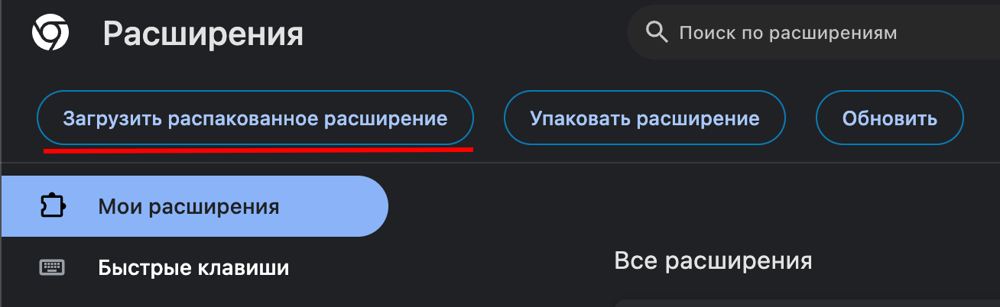
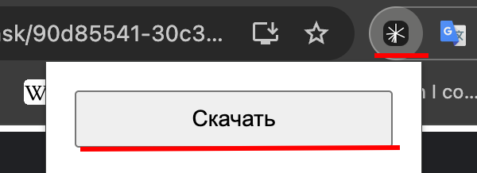

## Как установить и использовать расширение:
### 1. Скачать репозиторий.
### 2. В google chrome открыть следующую вкладку:
```
chrome://extensions/
```
### 3. Нажать «Загрузить распакованное расширение»


### 4. На странице с тестовым заданием нажать на иноку расширения и нажать кнопку скачать:
